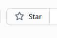

# ATM系统
本系统为课程设计项目，为了使其他同学在课程设计遇到困难时有个代码参考。
---
### 课程设计题目
    使用 Java Web 实现一个自动提款机系统，包括用户登录、取款、存款和
    转账等功能，并且用户所有操作都需要在数据库中记录日志，方便管理员查看。
    数据库使用 MySQL；前端界面使用 BootStrap，并适配移动端浏览器；日志功能
    请使用 log4j 将日志记录数据库
### 系统运行使用框架（针对无开发经验者）
    前端： jquery / bootstrap : 2个框架均无需下载，在页面内已经使用了网络版本(cdn)，
          直接使用即可
    后端： springBoot / mybatis : 框架需要下载，但无需配置，建议使用idea作为开发
          环境，内部使用maven下载这2个框架以及配套的框架，框架的使用情况在pom.xml
          内可查询
# 写在最后的话
### 本系统开源是为了方便各位在课程设计遇到困难时能有一个用于快速完成任务的程序，有能力或者想挑战自己的同学建议自己写。内部的东西还是较为完善，对于完成课设来说已经绰绰有余。
### 开发不易，如果感到本项目对自己有帮助的话可以适当的打赏一下作者，同时在右上角给颗星星也是对我的一种鼓励。

---
本项目有前端使用vue版，需要可联系 
针对本课程设计对应的课设报告，需要可联系我 
联系方式：(邮箱) zhang_hao_cn@foxmail.com 
联系时需在邮件主题上写：课程设计github，否则可能被当做垃圾邮件处理。
---
#赞赏码：
